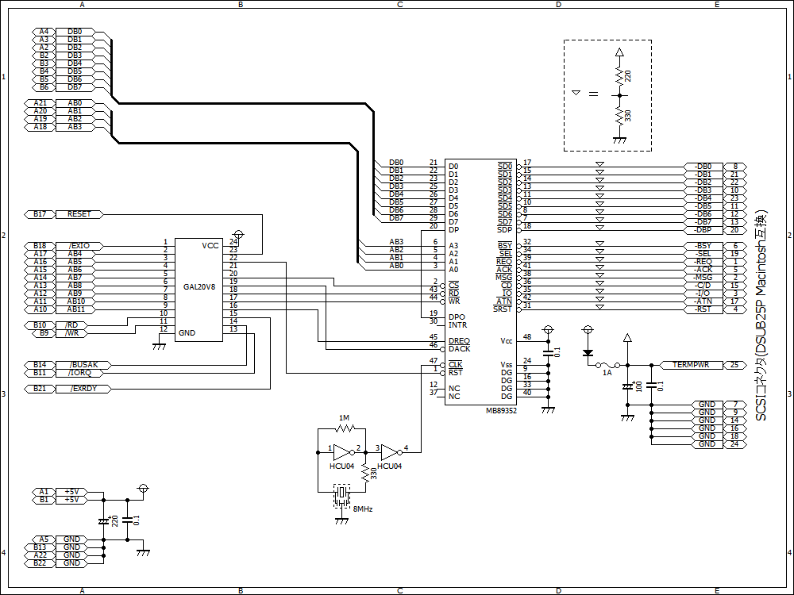

# SCSI for X1turbo
## 概要
* BIOSレベルで100%互換なので、BIOS経由のソフトウェアは全て動作します
* 1ブロックのサイズを常に256バイトとして処理しているので、光磁気ディスクやCD-ROMからのブートも可能です
* 光磁気ディスク等のリムーバブルデバイスでは、メディアの交換が可能です（当然と言えば当然ですが）
## ちょっといじるとできる事
* HuBASICで扱える上限値の16MBまで使用できます
* HD4:～HD9:も使用できます（これは従来のSASIでも可能です）
## （そのままでは）動作しないソフトウェア
* "HDFORMAT.UTY"…物理フォーマットのためにマシン語呼出している部分を消すことで動作するようになります
* "ユーザー辞書確保.Uty"…BIOSを使わないアクセスをしているため動作しませんが、僅かな変更で動作するようになります
## 使い方
アセンブラには[zmac](http://www.48k.ca/zmac.html)を用いていますが、一般的なZ80アセンブラであれば簡単な手直し程度でアセンブルできると思います。  
内容を見ていただければ分かると思いますが、SCSI以外に余計な事をしているので、環境に合わせてお使いください。**特にFDC周りのパッチには、シーク速度の低速なFDDが使用不能になる内容もあるので注意してください。**  
## 回路図

[GAL20V8](./scsi.pld)はアドレスデコードで楽をしたいという理由だけで使用しています。  
SPC(MB89352)へのクロックですが、8MHz出力のオシレータの方が手軽な上に再現性も高く手間もかからないため、結果的には安価だと思われます。